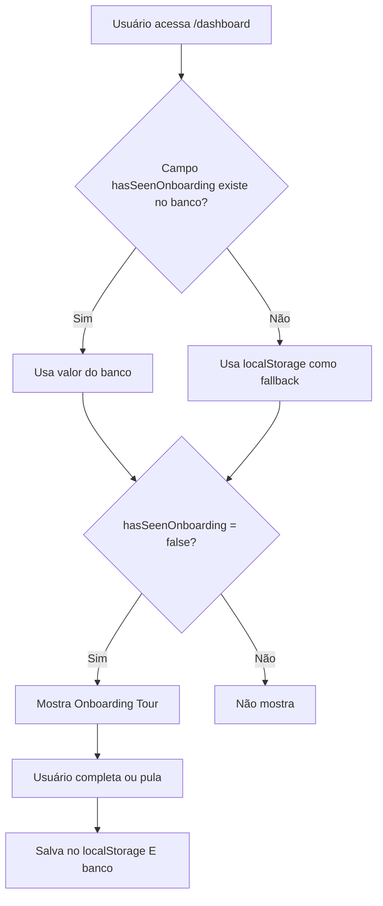

# ✅ Setup do Onboarding - Instruções

## Status Atual

O sistema de onboarding está **funcionando com fallback**! Ele usa:
- ✅ `localStorage` (funcionando agora)
- ⏳ `banco de dados` (precisa da migration)

## 🚀 Testando Agora Mesmo

1. **Limpar cache do usuário** para simular primeiro acesso:
   ```javascript
   // Cole no console do navegador (F12 > Console)
   localStorage.removeItem('onboarding_completed_v1')
   location.reload()
   ```

2. **Criar novo usuário** e fazer login - o onboarding deve aparecer!

## 📊 Logs de Debug

Abra o console do navegador (F12 > Console) para ver os logs:

```
[ONBOARDING] hasSeenOnboarding do banco: undefined
[ONBOARDING] totalAnalyses: 0
[ONBOARDING] hasSeenOnboarding final: false
[ONBOARDING] isFirstAccess: true
[ONBOARDING] Vai mostrar onboarding em 500ms
[ONBOARDING] Mostrando onboarding agora
```

## 🔧 Próximo Passo: Migration Permanente

Para usar o banco de dados ao invés do localStorage:

### 1. Gerar a migration

```bash
npm run db:migrate
```

Nome da migration quando solicitar:
```
add_has_seen_onboarding_to_users
```

### 2. Verificar se foi aplicada

```bash
npm run db:studio
```

Abra a tabela `users` e veja se existe a coluna `hasSeenOnboarding`.

### 3. Limpar logs de debug (opcional)

Após confirmar que funciona, você pode remover os `console.log` do código.

## ❓ Troubleshooting

### Onboarding não aparece?

1. **Abra o console** (F12) e veja os logs `[ONBOARDING]`
2. **Verifique se os elementos existem**:
   ```javascript
   document.querySelector('[data-onboarding="nova-analise"]')
   document.querySelector('[data-onboarding="area-analises"]')
   ```
3. **Force mostrar**:
   ```javascript
   localStorage.removeItem('onboarding_completed_v1')
   location.reload()
   ```

### Erro de conexão com banco?

Se estiver tendo erro de timeout no banco (erro que você reportou antes):

1. **Verifique se Supabase está ativo** - projetos free tier pausam
2. **Acesse o Supabase Dashboard** e ative o projeto
3. **Verifique DATABASE_URL** no arquivo `.env`

### Onboarding aparece sempre?

Verifique se está salvando corretamente:
```javascript
// No console após completar o onboarding
localStorage.getItem('onboarding_completed_v1') // Deve retornar 'true'
```

## 🎯 Como Funciona

### Fluxo Completo



### Dupla Proteção

O sistema tem **dupla proteção** para garantir que funciona:

1. **localStorage**: Funciona imediatamente, mesmo sem migration
2. **Banco de dados**: Funciona em qualquer dispositivo após a migration

Quando ambos existem, o **banco tem prioridade**.
